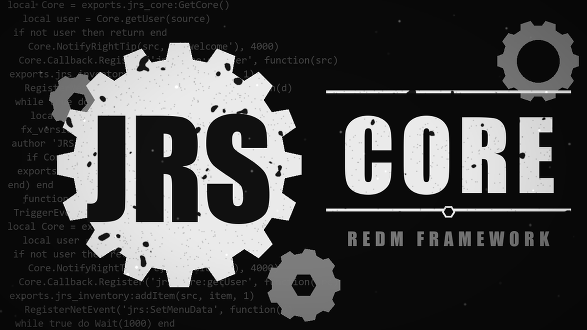

# Hi, I'm Jehad &#128075;

**RedM developer &middot; building [JRS Core](https://github.com/NQ3Z/jrscore), a free and open-source roleplay framework**

---

## &#127988; What I work on

- **[JRS Core](https://github.com/NQ3Z/jrscore)** &mdash; a complete RedM server pack: one core, one inventory, one visual style, 70+ resources that work together, installed with a single txAdmin recipe.
- **[Documentation](https://docs.jrs-core.com)** &mdash; a multilingual docs site (16 languages) with the full API reference, every script explained one by one, and an editor extension for VS Code.
- **Server tooling** &mdash; Lua, Node.js and Discord bots for community servers.

## &#129520; Tech

## &#128230; Pinned

| Project | What it is |
|---|---|
| [**jrscore**](https://github.com/NQ3Z/jrscore) | The free JRS Core RedM framework pack with txAdmin recipe and installer |

## &#129309; Get in touch

- Questions, ideas or bugs about JRS Core: open an [issue](https://github.com/NQ3Z/jrscore/issues) or join the [Discord](https://discord.gg/jrscore).
- I speak **Arabic** and **English** (&#1575;&#1604;&#1593;&#1585;&#1576;&#1610;&#1577; &middot; English).

Built with care for the RedM community.

